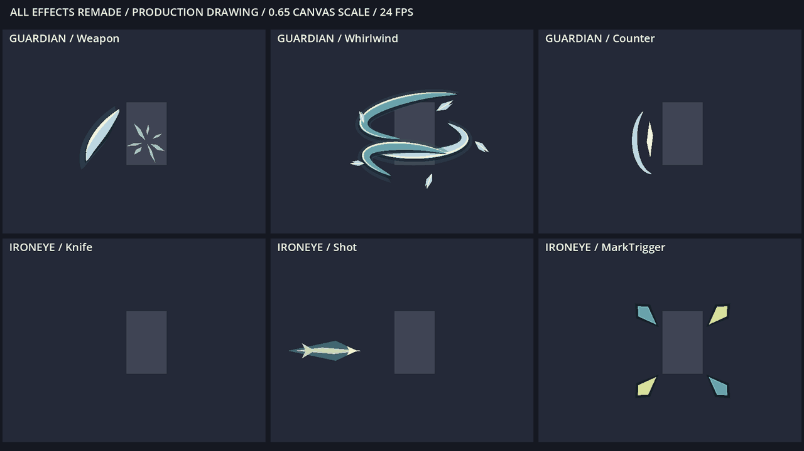
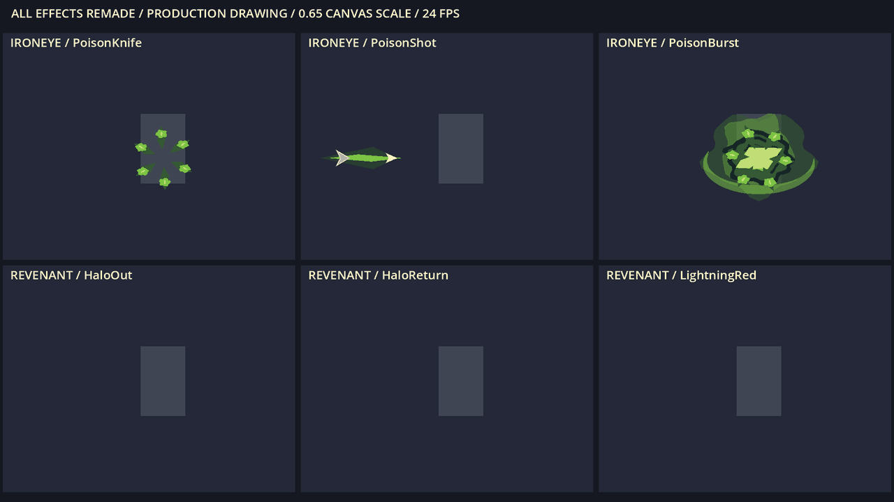
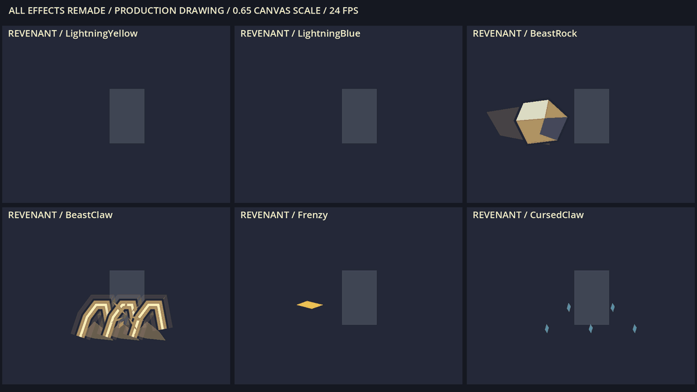
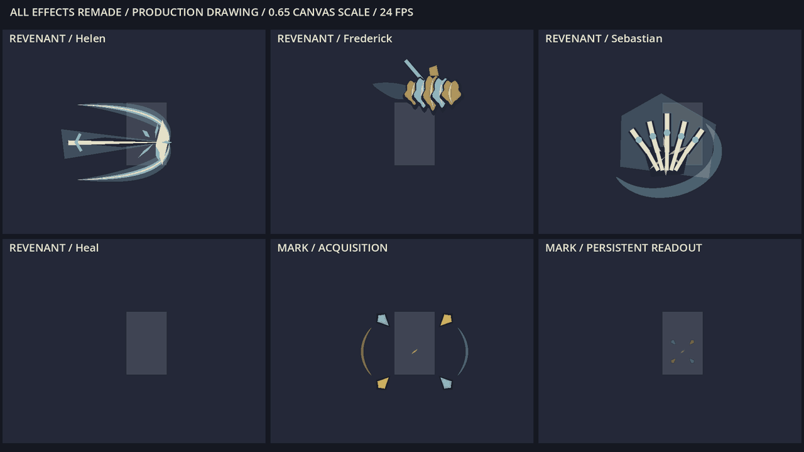
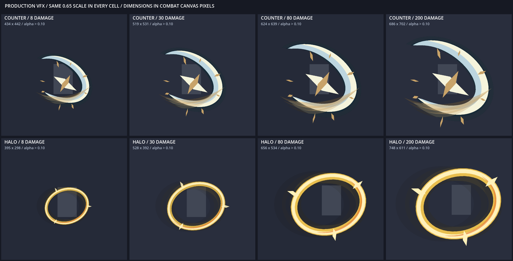
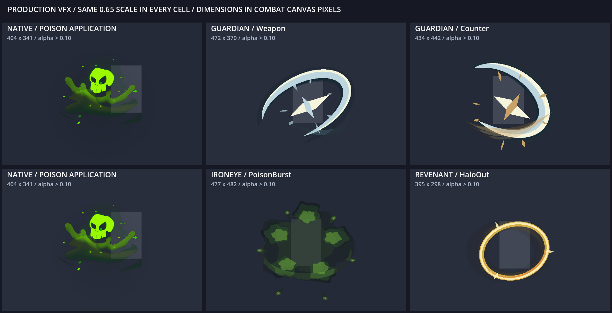

# 全部特效动态预览

22 类战斗特效和标记反馈均已重制。以下为生产绘图代码的实际 Godot 渲染；灰色矩形是统一尺度标尺。四段循环动画覆盖全部效果。

## 守护者三类、铁之眼普通刀箭与标记裂解

## 三类毒效果、光环往返、红雷

## 黄雷、蓝雷、投石、爪浪、癫火、咒爪

## 三位家人、治疗、标记出现与常驻

## 防御反击与光环：8、30、80、200 点伤害

## 原版施毒的同尺度参照

[逐项审查与测量记录](../../三角色全量特效重制审查_20260910.md)
