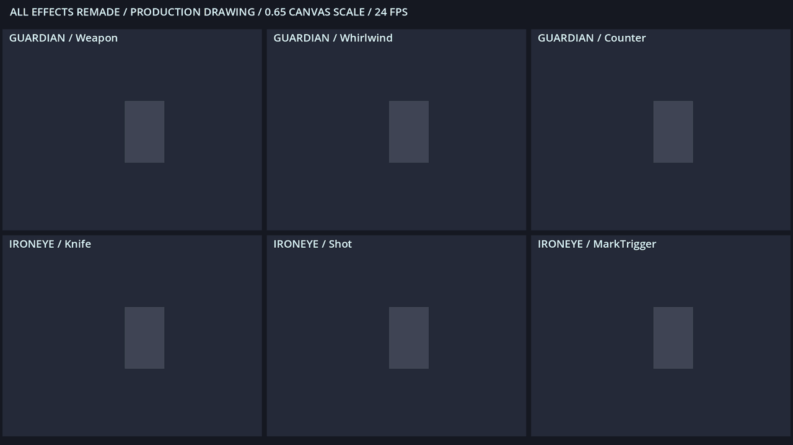
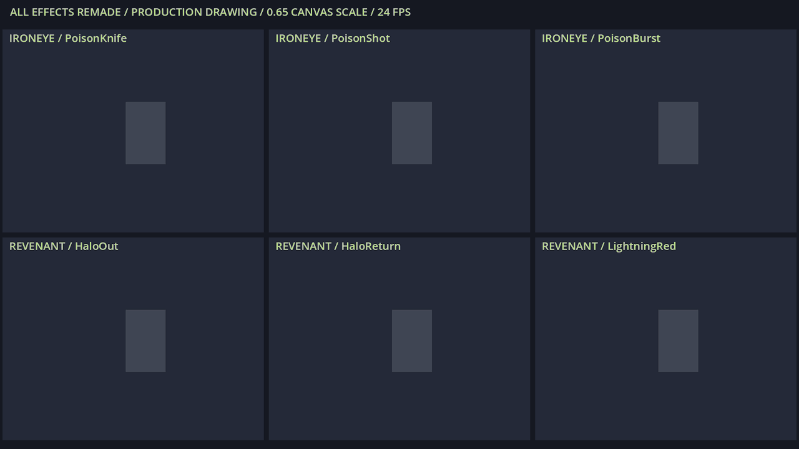
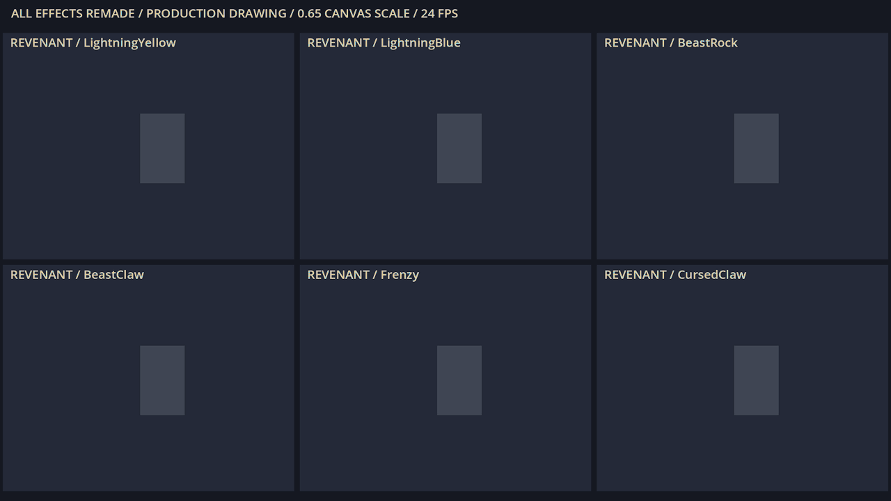
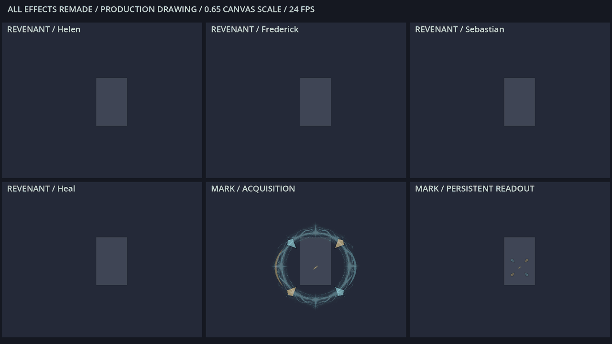
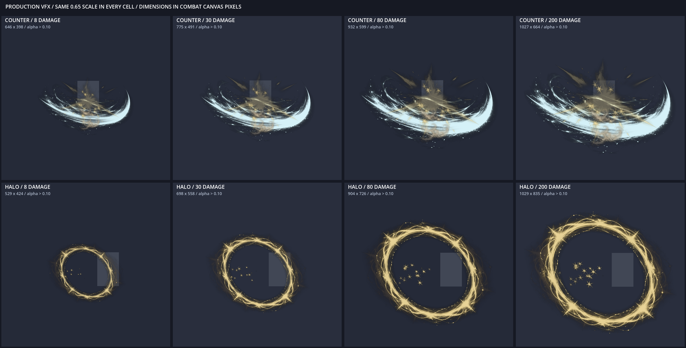
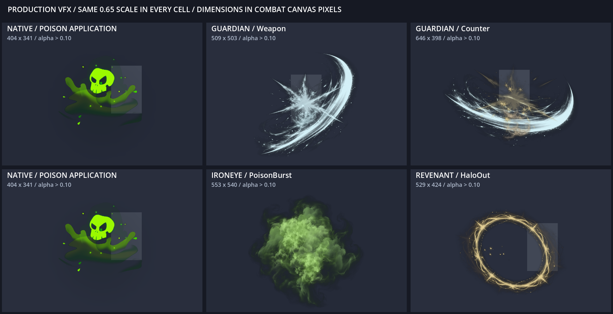

# 生成贴图＋原生粒子＋Shader：全部特效动态预览

四张生成图集、16 个素材，重制全部 22 类战斗效果。以下直接录制生产代码并从导出的 PCK 读取贴图；灰块是统一尺寸标尺。

## 守护者三类、铁之眼刀箭与标记裂解

## 毒刃、毒箭、毒爆、光环往返与红雷

## 黄雷、冰雷、投石、爪浪、癫火与咒爪

## 三位家人的攻击、治疗与标记反馈

## 防御反击与光环：8 / 30 / 80 / 200 点伤害

## 原版施毒同尺度参照

[贴图来源与完整提示词](../../../images/vfx/particle_remake/GENERATION.md)

[全量审查记录](../../三角色贴图粒子特效重制_20260910.md)
